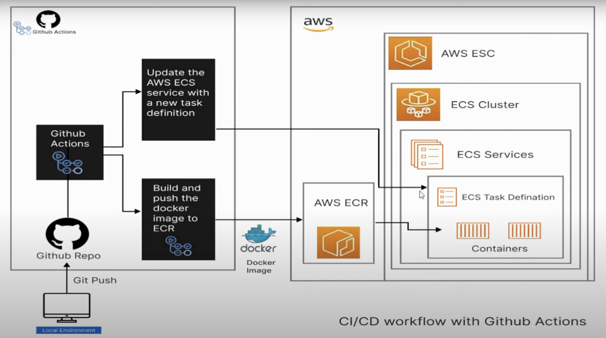

Reference blog t use terraform as IaC
https://medium.com/@vladkens/aws-ecs-cluster-on-ec2-with-terraform-2023-fdb9f6b7db07

<h1>VPC with public subnet</h1>
<h1>Internet Gateway to connect to the global Internet</h1>
<h1>Security groups for EC2 Node & ECS Service</h1>
<h1>Auto-scaling group for ECS cluster with Launch Templates</h1>
<h1>Publish image to ECR</h1>
<h1>ECS cluster with task and service definition</h1>
<h1>Load Balancer to public access & scale ECS Service</h1>

